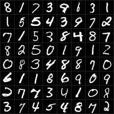
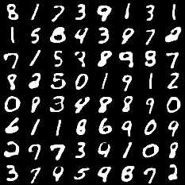
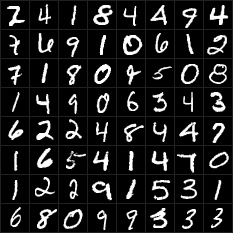
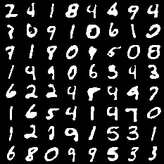

# AE Result
- noise image in training stage

<p>
- denoise image (auto-encoder) in training stage

<p>
- noise image in validation stage

<p>
- denoise image (auto-encoder) in valiation stage<p>


# VAE Result
- train stage: 
  - raw image \
<p>
  - generated_img \
<p>

- val stage:
  - raw image \
<p>
  - generated_img \
<p>


# Usage
## install package

```shell
conda create -n auto python=3.6
conda activate auto
cd ./auto-encoder

pip install -r ./requirements.txt

python train.py  # for AE
python vae_train.py # for VAE
```

# Reference 

## VAE
- https://adaning.github.io/posts/9047.html
- https://blog.csdn.net/heyc861221/article/details/80130968
- https://www.cnblogs.com/weilonghu/p/12567793.html
- https://zhuanlan.zhihu.com/p/144649293 (very good article!!!)

### github refer
- https://github.com/AntixK/PyTorch-VAE
- https://github.com/ethanluoyc/pytorch-vae/blob/master/vae.py

## Binary cross entropy
- https://blog.csdn.net/Cy_coding/article/details/116427968

