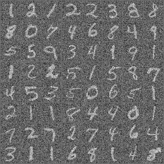
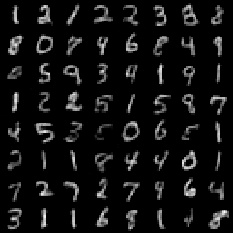
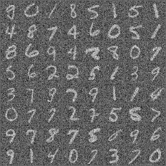
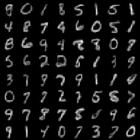

# Result
- noise image in training stage

<p>
- denoise image (auto-encoder) in training stage

<p>
- noise image in validation stage

<p>
- denoise image (auto-encoder) in valiation stage<p>



# Usage
## install package

```shell
conda create -n auto python=3.6
conda activate auto
cd ./auto-encoder

pip install -r ./requirements.txt

python train.py
```